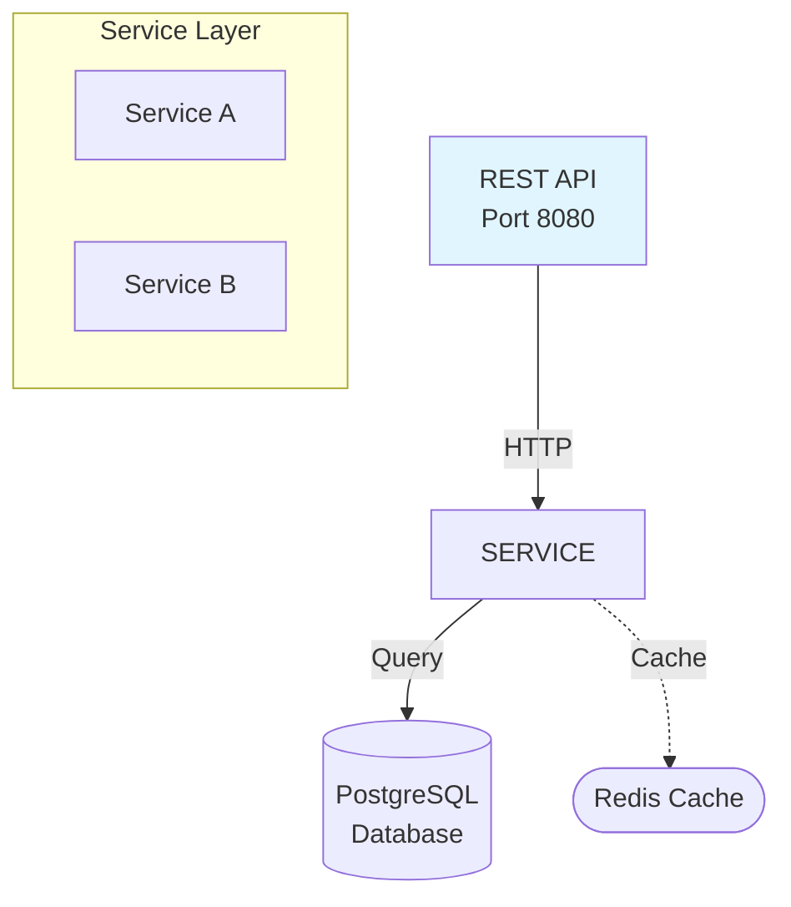

# Architecture Analysis and Diagram Generation Prompt

## Prompt Template

Use this prompt to have an AI assistant thoroughly analyze a codebase and create comprehensive architecture diagrams:

---

### PROMPT:

**Thoroughly analyze this project's architecture and create a comprehensive diagram that represents every component and how they communicate with each other. Include all middleware, data flows, and infrastructure layers.**

Please perform the following analysis:

## 1. Discovery Phase
- Identify the main entry points (services, APIs, CLIs)
- Map all major components and their responsibilities
- Trace data flow paths through the system
- Identify all external dependencies and integrations
- Document communication protocols (HTTP, WebSocket, gRPC, etc.)
- Find all middleware layers and their purposes
- Identify data storage systems and their schemas
- Map configuration and environment management

## 2. Architecture Layers to Document
Please identify and diagram these layers if present:
- **External/Client Layer**: All client types and access methods
- **API/Interface Layer**: REST, GraphQL, WebSocket endpoints
- **Middleware Layer**: Auth, logging, rate limiting, session management
- **Business Logic Layer**: Core processing, domain logic
- **Data Access Layer**: ORMs, repositories, data mappers
- **Storage Layer**: Databases, caches, file systems, message queues
- **Infrastructure Layer**: Docker, Kubernetes, cloud services
- **Cross-cutting Concerns**: Logging, monitoring, error handling, security

## 3. Component Analysis
For each major component, identify:
- Purpose and responsibilities
- Input/output interfaces
- Dependencies (what it uses)
- Dependents (what uses it)
- Communication patterns (sync/async, push/pull)
- State management approach
- Error handling strategy
- Performance characteristics

## 4. Data Flow Documentation
Trace and document:
- Request/response flows
- Event flows and pub/sub patterns
- Data transformation pipelines
- Cache strategies and invalidation
- Session/state management flows
- Background job processing
- Real-time update mechanisms

## 5. Diagram Requirements
Create a Mermaid diagram that includes:

### Visual Elements:
- Clear component boundaries (subgraphs)
- Directional arrows showing data/control flow
- Different styles for different component types
- Labels on connections showing protocols/data types
- Separation of concerns via visual grouping

### Essential Information:
- Component names and primary responsibilities
- Port numbers and endpoints
- Database/cache types and purposes
- Message queue topics/channels
- API versioning
- Authentication/authorization flows
- Configuration sources

### Style Guidelines:
- Use consistent naming conventions
- Group related components in subgraphs
- Use different colors/styles for:
  - New/changed components (if analyzing updates)
  - External vs internal components
  - Different architectural layers
  - Different communication types
- Keep labels concise but informative
- Avoid special characters that break Mermaid syntax

## 6. Documentation Structure
Provide the analysis in this format:

1. **Executive Summary**: 2-3 paragraph overview of the architecture
2. **Key Components**: Bullet list of major components and their roles
3. **Architecture Diagram**: Complete Mermaid diagram
4. **Component Details**: Detailed description of each major component
5. **Communication Patterns**: How components interact
6. **Data Flow Scenarios**: Common request/operation flows
7. **Technology Stack**: List of technologies, frameworks, and tools
8. **Deployment Architecture**: How the system is deployed
9. **Scalability & Performance**: Key architectural decisions for scale
10. **Security Architecture**: Authentication, authorization, data protection

## 7. Special Considerations
Also analyze and document:
- Multi-tenancy/user isolation mechanisms
- Microservices boundaries and communication
- Event sourcing/CQRS patterns if present
- Circuit breakers and resilience patterns
- Service discovery mechanisms
- Load balancing strategies
- Caching layers and strategies
- Asynchronous processing patterns
- Monitoring and observability hooks

## 8. Version Comparison (if applicable)
If analyzing an updated architecture:
- Highlight what's new/changed
- Show migration paths
- Document breaking changes
- Identify deprecated components
- Show compatibility layers

## Output Format
Deliver the analysis as a Markdown file with:
- Clear section headers
- Mermaid diagram(s) in code blocks
- Bullet points for lists
- Code examples where relevant
- Tables for comparing options/versions
- Links to relevant source files (using file:line format)

---

## Example Usage

1. **For initial architecture analysis:**
   "Thoroughly analyze this project's architecture and create a comprehensive diagram that represents every component and how they communicate with each other. Include all middleware, data flows, and infrastructure layers."

2. **For architecture updates:**
   "There have been major architectural changes. Re-analyze the code base and provide a new updated diagram showing what has changed."

3. **For specific focus areas:**
   "Analyze the architecture focusing on [data flow/security/scalability/API layer] and create a detailed diagram of that subsystem."

4. **For comparison:**
   "Analyze both the v1 and v2 architectures and create diagrams showing the evolution and improvements."

## Tips for Best Results

1. **Provide Context**: Share README files, documentation, or architecture decision records (ADRs)
2. **Specify Focus**: Indicate if you want emphasis on particular aspects
3. **Mention Constraints**: Share any specific diagramming requirements or style guides
4. **Include Examples**: Provide examples of diagram styles you prefer
5. **Request Iterations**: Ask for refinements if the first version needs adjustments

## Common Architecture Patterns to Look For

- **Layered Architecture**: Presentation → Business → Data layers
- **Microservices**: Service boundaries, API gateways, service mesh
- **Event-Driven**: Event bus, publishers, subscribers, event store
- **CQRS**: Command and query separation, read/write models
- **Hexagonal/Ports & Adapters**: Core domain with adapters
- **MVC/MVP/MVVM**: Model-View patterns
- **Pipeline**: Sequential processing stages
- **Client-Server**: Request/response patterns
- **Peer-to-Peer**: Distributed communication
- **Service-Oriented**: Service registry, ESB

## Mermaid Syntax Reminders

This prompt template will help generate consistent, comprehensive architecture diagrams that effectively communicate system design and component relationships.