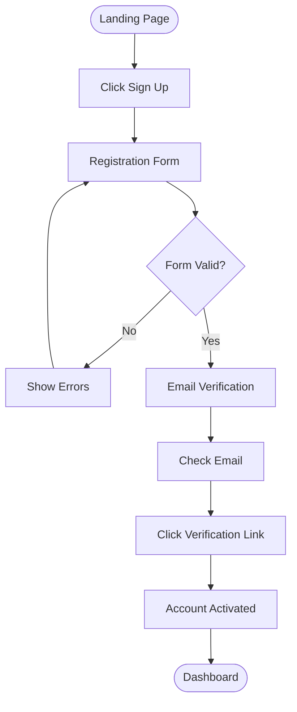
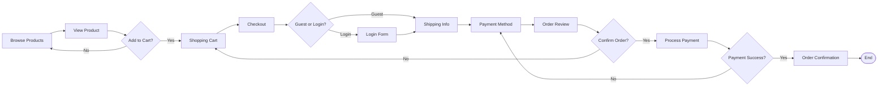

# User Flows & Journey Maps

**Purpose**: Document user paths through the application and identify optimization opportunities.  
**Audience**: Product managers, designers, developers, UX researchers  
**Update Frequency**: On feature changes, after user research

## User Flow Notation

### Flow Chart Symbols
```
┌─────────┐   Rectangle = Screen/Page
│         │   
└─────────┘   

◇             Diamond = Decision Point

○             Circle = Start/End Point

→             Arrow = User Action/Direction

[Action]      Bracket = User Action

{Condition}   Curly Brace = System Condition
```

## Core User Flows

### 1. User Registration Flow



#### Steps & Screens
| Step | Screen | User Action | System Response | Drop-off Risk |
|------|--------|-------------|-----------------|---------------|
| 1 | Landing Page | Click "Sign Up" | Show registration form | Low |
| 2 | Registration Form | Fill in details | Validate in real-time | Medium |
| 3 | Registration Form | Submit form | Process registration | High |
| 4 | Email Sent | Check email | Send verification email | Medium |
| 5 | Email | Click verification link | Verify account | High |
| 6 | Success Page | Continue to app | Redirect to dashboard | Low |

#### Optimization Opportunities
- **Social sign-up**: Reduce form friction
- **Progressive disclosure**: Ask for minimum info first
- **Inline validation**: Reduce form errors
- **Magic link**: Skip password creation
- **Resend email**: Clear CTA for verification resend

### 2. User Login Flow

```
○ Start
│
├─[Enter Credentials]
│
├─{Valid?}──No──→[Error Message]─┐
│                                 │
├─Yes                            │
│                                │
├─{2FA Enabled?}──No─────────────┼─→ ○ Dashboard
│                                │
├─Yes                           │
│                               │
├─[Enter 2FA Code]              │
│                               │
├─{Valid?}──No──→[Error]────────┘
│
└─Yes──→ ○ Dashboard
```

#### Edge Cases
- Forgot password flow
- Account locked after attempts
- Expired sessions
- Social login failures
- 2FA device lost

### 3. Purchase Flow



#### Conversion Funnel
| Stage | Screen | Conversion Rate | Drop-off Rate | Optimization |
|-------|--------|-----------------|---------------|--------------|
| Browse | Product Listing | 100% | - | - |
| View | Product Detail | 45% | 55% | Better thumbnails |
| Add to Cart | Cart | 20% | 55% | Clear CTA |
| Checkout | Checkout Start | 10% | 50% | Guest checkout |
| Complete | Order Success | 5% | 50% | Simplify form |

### 4. Search & Discovery Flow

```
User Intent
    │
    ├─ Direct Search ──→ Search Bar ──→ Results ──→ Filter/Sort
    │                                      │
    ├─ Browse ─────────→ Categories ──────┤
    │                                      │
    ├─ Recommendations → Personalized ────┤
    │                                      │
    └─ External ───────→ Landing Page ────┴──→ Product Detail
                              │
                              └──→ Action (Buy/Save/Share)
```

## User Journey Maps

### New User Journey

#### Journey Stages
| Stage | Awareness | Consideration | Decision | Onboarding | Retention |
|-------|-----------|---------------|----------|------------|-----------|
| **User Goals** | Find solution | Evaluate options | Make choice | Get started | Achieve value |
| **Actions** | Search, ask peers | Compare, read reviews | Sign up, purchase | Setup, learn | Use regularly |
| **Touchpoints** | Ads, blog, social | Website, demos | Pricing, trial | Email, app | App, support |
| **Emotions** | Curious, skeptical | Interested, uncertain | Excited, nervous | Hopeful, confused | Satisfied, confident |
| **Pain Points** | Info overload | Unclear value | Price concerns | Complex setup | Learning curve |
| **Opportunities** | Clear messaging | Social proof | Risk reversal | Guided setup | Quick wins |

#### Emotional Journey
```
Excitement ────┐                    ┌─────────────
               │                    │
Neutral ───────┼────────────────────┼─────────────
               │        ┌──┐        │
Frustration ───┘        └──┘        └─────────────
               Signup   Setup     First Success
```

### Returning User Journey

#### Daily Workflow
```
06:00 ─────────────────────────────────────→ 22:00
  │                                              │
  ├─ Morning Check ──→ Quick Actions             │
  │      ↓                   │                   │
  │   Dashboard           Process Items          │
  │      ↓                   │                   │
  ├─ Deep Work ───────→ Focus Mode               │
  │                          │                   │
  ├─ Afternoon ────→ Collaboration               │
  │                          │                   │
  └─ Evening ──────→ Review & Plan ──────────────┘
```

## Task Flows

### Primary Task: Create Project

```
Start: Dashboard
    │
    ├─ Click "New Project"
    │
    ├─ Choose Template?
    │   ├─ Yes → Select Template → Customize
    │   └─ No → Blank Project
    │
    ├─ Enter Details
    │   ├─ Name (required)
    │   ├─ Description (optional)
    │   └─ Settings (advanced)
    │
    ├─ Add Team Members?
    │   ├─ Yes → Search/Select → Set Permissions
    │   └─ No → Skip
    │
    ├─ Create Project
    │
    └─ Success → Project Dashboard
```

#### Time Analysis
| Step | Average Time | Friction Points | Improvement |
|------|-------------|-----------------|-------------|
| Start | 2s | Finding button | Prominent CTA |
| Template | 15s | Too many options | Recommendations |
| Details | 30s | Required fields | Smart defaults |
| Team | 45s | Search complexity | Recent contacts |
| Create | 3s | Processing time | Progress indicator |
| **Total** | **95s** | - | Target: <60s |

### Secondary Task: Share Content

```
Content View
    │
    ├─ Click Share
    │
    ├─ Share Method
    │   ├─ Link → Copy/Generate → Set Permissions
    │   ├─ Email → Add Recipients → Add Message → Send
    │   ├─ Social → Choose Platform → Customize → Post
    │   └─ Embed → Get Code → Copy
    │
    └─ Confirmation → Track Engagement
```

## Error Recovery Flows

### Payment Failure Recovery

```
Payment Failed
    │
    ├─ Show Error
    │   ├─ Insufficient Funds → Suggest Other Payment
    │   ├─ Card Expired → Update Card
    │   ├─ Technical Error → Retry
    │   └─ Fraud Detection → Verify Identity
    │
    ├─ Recovery Options
    │   ├─ Try Different Card
    │   ├─ Use PayPal
    │   ├─ Contact Support
    │   └─ Save Cart & Exit
    │
    └─ Success Path → Complete Order
```

### Session Timeout Recovery

```
Session Expired
    │
    ├─ Save Current State
    │
    ├─ Show Login Modal
    │
    ├─ Re-authenticate
    │   ├─ Success → Restore State → Continue
    │   └─ Failure → Login Page → Start Over
    │
    └─ Alternative: Extend Session Warning (30s before)
```

## Mobile User Flows

### Mobile-Specific Considerations

#### Thumb Zones
```
┌─────────────┐
│   Hard      │  Difficult to reach
├─────────────┤
│   Medium    │  Requires stretch
├─────────────┤
│   Easy      │  Natural thumb area
│             │  (Primary actions here)
└─────────────┘
```

#### Mobile Navigation Flow
```
Tab Bar (Bottom)
    ├─ Home
    ├─ Search
    ├─ Create (+)
    ├─ Activity
    └─ Profile
        └─ Settings
            ├─ Account
            ├─ Privacy
            ├─ Notifications
            └─ Help
```

## Accessibility Flows

### Screen Reader Navigation

```
Page Load
    │
    ├─ Announce Page Title
    │
    ├─ Skip Links
    │   ├─ Skip to Main
    │   ├─ Skip to Navigation
    │   └─ Skip to Search
    │
    ├─ Landmark Navigation
    │   ├─ Banner (Header)
    │   ├─ Navigation
    │   ├─ Main
    │   ├─ Complementary (Sidebar)
    │   └─ ContentInfo (Footer)
    │
    └─ Heading Navigation (H1 → H2 → H3)
```

### Keyboard-Only Flow

```
Tab Key Navigation
    │
    ├─ Interactive Elements Only
    │
    ├─ Logical Order (Left→Right, Top→Bottom)
    │
    ├─ Focus Indicators Visible
    │
    ├─ Escape Closes Modals
    │
    └─ Enter/Space Activates
```

## Flow Optimization

### Metrics & KPIs

#### Flow Metrics
| Metric | Definition | Target | Current |
|--------|------------|---------|---------|
| **Task Success Rate** | % completing task | >90% | [measure] |
| **Time on Task** | Average duration | <2 min | [measure] |
| **Error Rate** | Errors per task | <5% | [measure] |
| **Drop-off Rate** | % abandoning | <10% | [measure] |
| **Satisfaction** | User rating | >4.5 | [measure] |

### A/B Testing Flows

#### Test Variations
```
Version A (Control):
Start → Step 1 → Step 2 → Step 3 → End

Version B (Progressive):
Start → Step 1 → End → (Optional Step 2 → Step 3)

Version C (Consolidated):
Start → Combined Steps 1-3 → End
```

### Flow Optimization Techniques

1. **Reduce Steps**: Combine or eliminate unnecessary steps
2. **Progressive Disclosure**: Show advanced options only when needed
3. **Smart Defaults**: Pre-fill with intelligent suggestions
4. **Inline Actions**: Avoid page transitions when possible
5. **Persistent Progress**: Save state between sessions
6. **Alternative Paths**: Provide multiple ways to complete tasks
7. **Error Prevention**: Validate before submission
8. **Clear CTAs**: Make next actions obvious

## Documentation Tools

### Flow Diagram Tools
- **Figma/FigJam**: Collaborative flow charts
- **Miro/Mural**: Journey mapping
- **Draw.io**: Technical diagrams
- **Whimsical**: Simple flows
- **Lucidchart**: Complex systems

### Analytics Tools
- **Hotjar**: User recordings & heatmaps
- **FullStory**: Session replay
- **Google Analytics**: Flow visualization
- **Mixpanel**: Funnel analysis
- **Amplitude**: User paths

### Testing Tools
- **UsabilityHub**: Flow testing
- **Maze**: Prototype testing
- **UserTesting**: Recorded sessions
- **Optimal Workshop**: Tree testing

---
*Last Updated: [Date]*  
*UX Lead: [Name]*  
*Research Contact: research@example.com*