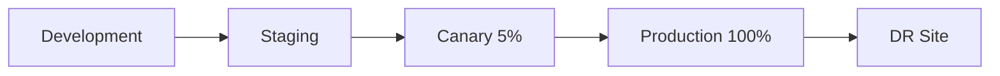

# Deployment Procedures

**Purpose**: Document deployment processes, strategies, and rollback procedures.  
**Audience**: DevOps engineers, developers, release managers  
**Update Frequency**: On process changes, reviewed quarterly

## Deployment Overview

### Deployment Environments
| Environment | Purpose | URL | Branch | Auto-Deploy |
|-------------|---------|-----|---------|-------------|
| Development | Feature testing | dev.example.com | develop | Yes |
| Staging | Pre-production | staging.example.com | staging | Yes |
| Production | Live users | example.com | main | Manual |
| DR | Disaster recovery | dr.example.com | main | Manual |

### Deployment Strategy
**Method**: Blue-Green Deployment with Canary Releases  
**Rollback Time**: < 5 minutes  
**Zero-Downtime**: Required for production



## Pre-Deployment Checklist

### Code Readiness
- [ ] All tests passing in CI
- [ ] Code review approved
- [ ] Security scan passed
- [ ] Performance benchmarks met
- [ ] Documentation updated
- [ ] Migration scripts tested
- [ ] Feature flags configured
- [ ] Rollback plan documented

### Infrastructure Readiness
- [ ] Database migrations prepared
- [ ] Secrets/configs updated
- [ ] CDN cache rules configured
- [ ] Load balancer health checks verified
- [ ] Monitoring alerts configured
- [ ] Backup completed
- [ ] Capacity verified

## Deployment Process

### 1. Staging Deployment
```bash
# Automated via GitHub Actions on merge to staging
name: Deploy to Staging

on:
  push:
    branches: [staging]

jobs:
  deploy:
    runs-on: ubuntu-latest
    steps:
      - uses: actions/checkout@v3
      
      - name: Run tests
        run: npm test
        
      - name: Build application
        run: npm run build:staging
        env:
          NODE_ENV: staging
          
      - name: Deploy to staging
        run: |
          aws ecs update-service \
            --cluster staging-cluster \
            --service app-service \
            --force-new-deployment
            
      - name: Wait for deployment
        run: |
          aws ecs wait services-stable \
            --cluster staging-cluster \
            --services app-service
            
      - name: Run smoke tests
        run: npm run test:smoke:staging
```

### 2. Production Deployment
```bash
#!/bin/bash
# deploy-production.sh

set -euo pipefail

# Configuration
CLUSTER="production-cluster"
SERVICE="app-service"
REGION="us-east-1"
ROLLBACK_VERSION=""

# Functions
log() {
  echo "[$(date +'%Y-%m-%d %H:%M:%S')] $1"
}

check_health() {
  local target_group=$1
  aws elbv2 describe-target-health \
    --target-group-arn $target_group \
    --query 'TargetHealthDescriptions[?TargetHealth.State==`healthy`]' \
    --output json
}

# Pre-deployment checks
log "Starting production deployment"
log "Running pre-deployment checks..."

# Backup current version
CURRENT_TASK=$(aws ecs describe-services \
  --cluster $CLUSTER \
  --services $SERVICE \
  --query 'services[0].taskDefinition' \
  --output text)
ROLLBACK_VERSION=${CURRENT_TASK##*/}
log "Current version: $ROLLBACK_VERSION"

# Create new task definition
log "Creating new task definition..."
NEW_TASK_DEF=$(aws ecs register-task-definition \
  --cli-input-json file://task-definition.json \
  --query 'taskDefinition.taskDefinitionArn' \
  --output text)

# Update service with new task definition
log "Updating ECS service..."
aws ecs update-service \
  --cluster $CLUSTER \
  --service $SERVICE \
  --task-definition $NEW_TASK_DEF \
  --desired-count 4 \
  --deployment-configuration "maximumPercent=200,minimumHealthyPercent=100" \
  --health-check-grace-period-seconds 60

# Monitor deployment
log "Monitoring deployment progress..."
while true; do
  DEPLOYMENTS=$(aws ecs describe-services \
    --cluster $CLUSTER \
    --services $SERVICE \
    --query 'services[0].deployments | length(@)')
    
  if [ "$DEPLOYMENTS" -eq "1" ]; then
    log "Deployment completed successfully"
    break
  fi
  
  log "Deployment in progress... ($DEPLOYMENTS active deployments)"
  sleep 30
done

# Verify deployment
log "Running post-deployment verification..."
npm run test:smoke:production

log "Deployment completed successfully!"
```

### 3. Canary Deployment
```javascript
// canary-deployment.js
const AWS = require('aws-sdk');
const cloudwatch = new AWS.CloudWatch();

async function canaryDeploy(config) {
  const stages = [
    { traffic: 5, duration: 5 * 60 * 1000 },   // 5% for 5 minutes
    { traffic: 25, duration: 10 * 60 * 1000 }, // 25% for 10 minutes
    { traffic: 50, duration: 10 * 60 * 1000 }, // 50% for 10 minutes
    { traffic: 100, duration: 0 }              // 100% complete
  ];

  for (const stage of stages) {
    console.log(`Shifting ${stage.traffic}% traffic to new version`);
    
    // Update load balancer weights
    await updateTargetGroupWeights(
      config.oldTargetGroup,
      100 - stage.traffic,
      config.newTargetGroup,
      stage.traffic
    );

    if (stage.duration > 0) {
      // Monitor metrics during canary period
      const healthy = await monitorCanaryMetrics(
        config.metricThresholds,
        stage.duration
      );

      if (!healthy) {
        console.error('Canary metrics unhealthy, rolling back');
        await rollback(config);
        throw new Error('Canary deployment failed');
      }
    }
  }

  console.log('Canary deployment successful');
}

async function monitorCanaryMetrics(thresholds, duration) {
  const startTime = Date.now();
  
  while (Date.now() - startTime < duration) {
    const metrics = await cloudwatch.getMetricStatistics({
      Namespace: 'AWS/ELB',
      MetricName: 'TargetResponseTime',
      Dimensions: [{ Name: 'LoadBalancer', Value: 'app/prod-alb' }],
      StartTime: new Date(Date.now() - 5 * 60 * 1000),
      EndTime: new Date(),
      Period: 60,
      Statistics: ['Average']
    }).promise();

    const avgResponseTime = metrics.Datapoints[0]?.Average || 0;
    
    if (avgResponseTime > thresholds.responseTime) {
      return false;
    }

    // Check error rate
    const errorRate = await getErrorRate();
    if (errorRate > thresholds.errorRate) {
      return false;
    }

    await sleep(30000); // Check every 30 seconds
  }

  return true;
}
```

## Database Migrations

### Migration Strategy
```bash
#!/bin/bash
# migrate-database.sh

# Run migrations in transaction
npm run migrate:up -- --env production --transaction

# Verify migration success
MIGRATION_STATUS=$(npm run migrate:status -- --env production)
if [[ $MIGRATION_STATUS == *"pending"* ]]; then
  echo "ERROR: Migrations pending"
  exit 1
fi

# Run post-migration validation
npm run migrate:validate -- --env production
```

### Zero-Downtime Migrations
```sql
-- Example: Adding column without locking
-- Step 1: Add column as nullable
ALTER TABLE users 
ADD COLUMN IF NOT EXISTS phone VARCHAR(20);

-- Step 2: Deploy code that writes to new column
-- Step 3: Backfill data
UPDATE users 
SET phone = '000-000-0000' 
WHERE phone IS NULL;

-- Step 4: Add constraint after backfill
ALTER TABLE users 
ALTER COLUMN phone SET NOT NULL;

-- Example: Renaming column safely
-- Step 1: Add new column
ALTER TABLE products ADD COLUMN IF NOT EXISTS product_name VARCHAR(255);

-- Step 2: Copy data
UPDATE products SET product_name = name;

-- Step 3: Deploy code using new column
-- Step 4: Drop old column
ALTER TABLE products DROP COLUMN name;
```

## Rollback Procedures

### Automatic Rollback Triggers
```yaml
# Rollback conditions
rollback_triggers:
  - metric: ErrorRate
    threshold: 5%
    duration: 5m
    
  - metric: ResponseTime
    threshold: 2000ms
    duration: 5m
    
  - metric: HealthCheck
    threshold: 50%
    duration: 2m
```

### Manual Rollback Process
```bash
#!/bin/bash
# rollback.sh

CLUSTER="production-cluster"
SERVICE="app-service"
PREVIOUS_TASK_DEF=$1

if [ -z "$PREVIOUS_TASK_DEF" ]; then
  echo "Usage: ./rollback.sh <task-definition-revision>"
  exit 1
fi

echo "Rolling back to task definition: $PREVIOUS_TASK_DEF"

# Update service with previous task definition
aws ecs update-service \
  --cluster $CLUSTER \
  --service $SERVICE \
  --task-definition $PREVIOUS_TASK_DEF \
  --force-new-deployment

# Wait for rollback to complete
aws ecs wait services-stable \
  --cluster $CLUSTER \
  --services $SERVICE

echo "Rollback completed"

# Notify team
curl -X POST $SLACK_WEBHOOK_URL \
  -H 'Content-Type: application/json' \
  -d "{\"text\": \"Production rollback completed to version $PREVIOUS_TASK_DEF\"}"
```

### Database Rollback
```sql
-- Rollback migration
BEGIN;
  -- Run down migration
  SELECT migrate_down('migration_name');
  
  -- Verify rollback
  SELECT verify_schema_state('previous_version');
COMMIT;
```

## Feature Flags

### Feature Flag Management
```javascript
// feature-flags.js
const LaunchDarkly = require('launchdarkly-node-server-sdk');

class FeatureFlags {
  constructor() {
    this.client = LaunchDarkly.init(process.env.LAUNCHDARKLY_SDK_KEY);
  }

  async isEnabled(flag, user = {}) {
    await this.client.waitForInitialization();
    
    const context = {
      key: user.id || 'anonymous',
      email: user.email,
      custom: {
        plan: user.plan,
        region: user.region
      }
    };

    return await this.client.variation(flag, context, false);
  }

  async getPercentageRollout(flag, defaultValue = 0) {
    await this.client.waitForInitialization();
    
    const value = await this.client.variation(
      flag,
      { key: 'percentage-rollout' },
      defaultValue
    );
    
    return value;
  }
}

// Usage in deployment
const flags = new FeatureFlags();

// Gradual feature rollout
if (await flags.isEnabled('new-checkout-flow', req.user)) {
  // New feature code
} else {
  // Existing code
}
```

## Post-Deployment

### Smoke Tests
```javascript
// smoke-tests.js
const axios = require('axios');
const assert = require('assert');

async function runSmokeTests(baseUrl) {
  const tests = [
    {
      name: 'Health check',
      test: async () => {
        const response = await axios.get(`${baseUrl}/health`);
        assert.equal(response.status, 200);
        assert.equal(response.data.status, 'healthy');
      }
    },
    {
      name: 'API responds',
      test: async () => {
        const response = await axios.get(`${baseUrl}/api/version`);
        assert.equal(response.status, 200);
        assert(response.data.version);
      }
    },
    {
      name: 'Database connection',
      test: async () => {
        const response = await axios.get(`${baseUrl}/api/health/db`);
        assert.equal(response.data.database, 'connected');
      }
    },
    {
      name: 'Cache connection',
      test: async () => {
        const response = await axios.get(`${baseUrl}/api/health/cache`);
        assert.equal(response.data.cache, 'connected');
      }
    }
  ];

  for (const test of tests) {
    try {
      await test.test();
      console.log(`✅ ${test.name}`);
    } catch (error) {
      console.error(`❌ ${test.name}: ${error.message}`);
      throw error;
    }
  }
}

// Run tests
runSmokeTests(process.env.BASE_URL)
  .then(() => console.log('All smoke tests passed'))
  .catch(() => process.exit(1));
```

### Monitoring & Alerts
```javascript
// deployment-monitor.js
const CloudWatch = require('aws-sdk/clients/cloudwatch');
const cloudwatch = new CloudWatch();

async function monitorDeployment(deploymentId) {
  const alarms = [
    {
      name: `deployment-${deploymentId}-errors`,
      metric: 'Errors',
      threshold: 10,
      period: 300
    },
    {
      name: `deployment-${deploymentId}-latency`,
      metric: 'Latency',
      threshold: 1000,
      period: 300
    }
  ];

  for (const alarm of alarms) {
    await cloudwatch.putMetricAlarm({
      AlarmName: alarm.name,
      ComparisonOperator: 'GreaterThanThreshold',
      EvaluationPeriods: 2,
      MetricName: alarm.metric,
      Namespace: 'Application',
      Period: alarm.period,
      Statistic: 'Average',
      Threshold: alarm.threshold,
      ActionsEnabled: true,
      AlarmActions: [process.env.SNS_TOPIC_ARN]
    }).promise();
  }
}
```

## Deployment Communication

### Notification Templates
```markdown
# Deployment Started
**Environment**: Production  
**Version**: v2.1.0  
**Deployer**: @username  
**Start Time**: 2024-01-15 14:00 UTC  
**Expected Duration**: 30 minutes  
**Rollback Plan**: Available  

# Deployment Completed
**Environment**: Production  
**Version**: v2.1.0  
**Status**: ✅ Success  
**Duration**: 25 minutes  
**Changes**: [View Changelog](link)  
**Monitoring**: [Dashboard](link)  

# Deployment Failed
**Environment**: Production  
**Version**: v2.1.0  
**Status**: ❌ Failed  
**Error**: [Error details]  
**Action**: Automatic rollback initiated  
**Previous Version**: v2.0.9 (restored)  
```

## Emergency Procedures

### Hotfix Deployment
```bash
#!/bin/bash
# hotfix-deploy.sh

# Create hotfix branch from production
git checkout main
git pull origin main
git checkout -b hotfix/critical-bug-fix

# Apply fix
# ... make changes ...

# Fast-track deployment
git commit -m "HOTFIX: Critical bug fix"
git push origin hotfix/critical-bug-fix

# Deploy directly to production
./deploy-production.sh --skip-staging --notify-urgent

# Merge back to main and develop
git checkout main
git merge hotfix/critical-bug-fix
git push origin main

git checkout develop
git merge hotfix/critical-bug-fix
git push origin develop
```

### Disaster Recovery
```bash
# DR failover procedure
1. Verify primary site is down
2. Update DNS to point to DR site
3. Verify DR database is in sync
4. Scale DR infrastructure
5. Monitor DR site performance
6. Plan primary site recovery
```

## Deployment Calendar

### Deployment Windows
| Environment | Day | Time (UTC) | Duration | Blackout Dates |
|-------------|-----|------------|----------|----------------|
| Development | Any | Any | - | None |
| Staging | Mon-Fri | 09:00-17:00 | 1 hour | None |
| Production | Tue, Thu | 14:00-16:00 | 2 hours | Holidays, Dec 15-Jan 5 |

### Release Schedule
- **Major Releases**: Quarterly (Q1, Q2, Q3, Q4)
- **Minor Releases**: Monthly (First Tuesday)
- **Patches**: As needed (Emergency window)
- **Hotfixes**: Immediate (with approval)

---
*Last Updated: [Date]*  
*Deployment Lead: [Name]*  
*Emergency Contact: [Phone/Email]*