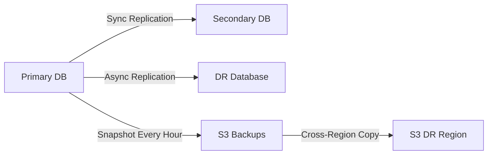

# Disaster Recovery Plan

**Purpose**: Define procedures for system recovery in case of disasters or major incidents.  
**Audience**: Leadership, DevOps, SREs, Security team  
**Update Frequency**: Bi-annual review, after major incidents

## DR Overview

### Recovery Objectives
| Metric | Target | Actual | Test Date |
|--------|---------|---------|-----------|
| **RTO** (Recovery Time Objective) | 4 hours | [Measured] | [Date] |
| **RPO** (Recovery Point Objective) | 1 hour | [Measured] | [Date] |
| **MTTR** (Mean Time To Recovery) | 2 hours | [Measured] | [Date] |
| **Data Loss Tolerance** | < 1 hour | [Measured] | [Date] |

### Disaster Classifications
| Level | Description | Examples | RTO | RPO |
|-------|-------------|----------|-----|-----|
| **L1 - Critical** | Complete system failure | Data center loss, regional outage | 1 hour | 15 min |
| **L2 - Major** | Core service failure | Database corruption, app failure | 2 hours | 30 min |
| **L3 - Moderate** | Partial service degradation | Single AZ failure, cache loss | 4 hours | 1 hour |
| **L4 - Minor** | Component failure | Single server, non-critical service | 8 hours | 4 hours |

## DR Architecture

### Multi-Region Setup
```yaml
Primary Region: us-east-1
  - Production Environment
  - Active databases
  - Primary user traffic
  
Secondary Region: us-west-2
  - DR Environment
  - Database replicas
  - Standby infrastructure
  
Backup Region: eu-west-1
  - Cold storage
  - Long-term backups
  - Compliance archives
```

### Data Replication Strategy


## Backup Strategy

### Backup Schedule
| Component | Frequency | Retention | Storage | Encryption |
|-----------|-----------|-----------|---------|------------|
| Database - Full | Daily 02:00 UTC | 30 days | S3 | AES-256 |
| Database - Incremental | Hourly | 7 days | S3 | AES-256 |
| Database - Transaction Logs | Continuous | 24 hours | S3 | AES-256 |
| Application State | Every 6 hours | 14 days | S3 | AES-256 |
| Configuration | On change | 90 days | Git + S3 | AES-256 |
| User Uploads | Real-time | Indefinite | S3 | AES-256 |
| Logs | Daily | 90 days | S3 Glacier | AES-256 |

### Backup Procedures
```bash
#!/bin/bash
# backup-all.sh

# Set variables
DATE=$(date +%Y%m%d_%H%M%S)
BACKUP_DIR="/backup/${DATE}"
S3_BUCKET="s3://company-backups"

# Create backup directory
mkdir -p ${BACKUP_DIR}

# 1. Database backup
echo "Starting database backup..."
pg_dump -h ${DB_HOST} -U ${DB_USER} -d ${DB_NAME} \
  --format=custom \
  --file=${BACKUP_DIR}/database.dump

# 2. Application state
echo "Backing up application state..."
kubectl get all --all-namespaces -o yaml > ${BACKUP_DIR}/k8s-resources.yaml
kubectl get secrets --all-namespaces -o yaml > ${BACKUP_DIR}/k8s-secrets.yaml
kubectl get configmaps --all-namespaces -o yaml > ${BACKUP_DIR}/k8s-configmaps.yaml

# 3. Configuration files
echo "Backing up configurations..."
tar -czf ${BACKUP_DIR}/configs.tar.gz /etc/app /etc/nginx

# 4. Verify backups
echo "Verifying backup integrity..."
pg_restore --list ${BACKUP_DIR}/database.dump > /dev/null || exit 1

# 5. Upload to S3
echo "Uploading to S3..."
aws s3 sync ${BACKUP_DIR}/ ${S3_BUCKET}/${DATE}/ \
  --sse AES256 \
  --storage-class STANDARD_IA

# 6. Cross-region replication
echo "Replicating to DR region..."
aws s3 sync ${S3_BUCKET}/${DATE}/ s3://company-backups-dr/${DATE}/ \
  --source-region us-east-1 \
  --region us-west-2

# 7. Cleanup old backups
echo "Cleaning up old backups..."
find /backup -mtime +7 -type d -exec rm -rf {} +

echo "Backup completed successfully"
```

### Backup Verification
```bash
#!/bin/bash
# verify-backups.sh

# Daily verification script
ERRORS=0

# Test database restore
echo "Testing database restore..."
pg_restore -h test-db -d test_restore latest_backup.dump
if [ $? -ne 0 ]; then
  echo "ERROR: Database restore failed"
  ERRORS=$((ERRORS + 1))
fi

# Verify file integrity
echo "Verifying file integrity..."
aws s3api head-object --bucket company-backups --key latest/database.dump \
  --checksum-mode ENABLED

# Test data recovery
echo "Testing data recovery..."
./scripts/test-data-recovery.sh
if [ $? -ne 0 ]; then
  ERRORS=$((ERRORS + 1))
fi

if [ $ERRORS -gt 0 ]; then
  ./scripts/alert-team.sh "Backup verification failed"
  exit 1
fi

echo "All backups verified successfully"
```

## Failover Procedures

### Automatic Failover
```yaml
# AWS Route53 Health Check Configuration
health_check:
  type: HTTPS
  resource_path: /health
  interval: 30
  failure_threshold: 2
  
failover_routing:
  primary:
    region: us-east-1
    weight: 100
    health_check: required
    
  secondary:
    region: us-west-2
    weight: 0
    health_check: required
    failover: secondary
```

### Manual Failover Process
```bash
#!/bin/bash
# manual-failover.sh

echo "========================================="
echo "     DISASTER RECOVERY FAILOVER         "
echo "========================================="

# Pre-checks
echo "Running pre-failover checks..."
./scripts/dr-pre-checks.sh || exit 1

# Confirmation
read -p "Confirm failover to DR site? Type 'FAILOVER' to proceed: " CONFIRM
if [ "$CONFIRM" != "FAILOVER" ]; then
  echo "Failover cancelled"
  exit 1
fi

# 1. Update DNS
echo "Step 1: Updating DNS records..."
aws route53 change-resource-record-sets \
  --hosted-zone-id ${ZONE_ID} \
  --change-batch '{
    "Changes": [{
      "Action": "UPSERT",
      "ResourceRecordSet": {
        "Name": "api.example.com",
        "Type": "A",
        "AliasTarget": {
          "HostedZoneId": "Z2FDTNDATAQYW2",
          "DNSName": "dr-alb.us-west-2.elb.amazonaws.com",
          "EvaluateTargetHealth": true
        }
      }
    }]
  }'

# 2. Scale DR infrastructure
echo "Step 2: Scaling DR infrastructure..."
aws ecs update-service \
  --cluster dr-cluster \
  --service app-service \
  --desired-count 10 \
  --region us-west-2

# 3. Promote database replica
echo "Step 3: Promoting database replica..."
aws rds promote-read-replica \
  --db-instance-identifier dr-database \
  --region us-west-2

# 4. Update application configuration
echo "Step 4: Updating application configuration..."
kubectl set env deployment/app \
  DATABASE_HOST=dr-database.us-west-2.rds.amazonaws.com \
  REDIS_HOST=dr-redis.us-west-2.cache.amazonaws.com \
  REGION=us-west-2 \
  -n production

# 5. Verify services
echo "Step 5: Verifying DR services..."
for service in api web admin; do
  response=$(curl -s -o /dev/null -w "%{http_code}" https://${service}.dr.example.com/health)
  if [ $response -eq 200 ]; then
    echo "✓ ${service} is healthy"
  else
    echo "✗ ${service} is not responding"
  fi
done

# 6. Update status page
echo "Step 6: Updating status page..."
curl -X POST https://api.statuspage.io/v1/incidents \
  -H "Authorization: OAuth ${STATUSPAGE_TOKEN}" \
  -d '{
    "incident": {
      "name": "Failover to DR site completed",
      "status": "monitoring",
      "impact": "minor"
    }
  }'

echo "========================================="
echo "    FAILOVER COMPLETED SUCCESSFULLY     "
echo "========================================="
echo "DR Site is now primary"
echo "Monitor: https://dr-dashboard.example.com"
```

## Recovery Procedures

### Data Recovery
```bash
#!/bin/bash
# data-recovery.sh

# Point-in-Time Recovery
recover_to_timestamp() {
  local TIMESTAMP=$1
  
  echo "Recovering database to ${TIMESTAMP}..."
  
  # Create new instance from backup
  aws rds restore-db-instance-to-point-in-time \
    --source-db-instance-identifier prod-database \
    --target-db-instance-identifier recovered-database \
    --restore-time ${TIMESTAMP} \
    --db-instance-class db.r5.2xlarge
    
  # Wait for recovery
  aws rds wait db-instance-available \
    --db-instance-identifier recovered-database
    
  # Verify data
  psql -h recovered-database.rds.amazonaws.com -c "
    SELECT COUNT(*) as record_count,
           MAX(created_at) as latest_record
    FROM critical_table;
  "
}

# File Recovery from S3
recover_files() {
  local BACKUP_DATE=$1
  local TARGET_DIR=$2
  
  echo "Recovering files from ${BACKUP_DATE}..."
  
  # List available backups
  aws s3 ls s3://company-backups/${BACKUP_DATE}/
  
  # Download files
  aws s3 sync s3://company-backups/${BACKUP_DATE}/ ${TARGET_DIR}/
  
  # Verify integrity
  find ${TARGET_DIR} -type f -exec md5sum {} \; > recovery_checksums.txt
}
```

### Service Restoration
```bash
#!/bin/bash
# service-restoration.sh

# Restore services in dependency order
SERVICES=(
  "database:critical"
  "cache:critical"
  "message-queue:critical"
  "auth-service:critical"
  "api-gateway:critical"
  "web-app:high"
  "admin-panel:medium"
  "reporting:low"
)

for service_priority in "${SERVICES[@]}"; do
  SERVICE="${service_priority%:*}"
  PRIORITY="${service_priority#*:}"
  
  echo "Restoring ${SERVICE} (Priority: ${PRIORITY})..."
  
  case ${SERVICE} in
    database)
      kubectl apply -f manifests/database.yaml
      kubectl wait --for=condition=ready pod -l app=database --timeout=300s
      ;;
    cache)
      kubectl apply -f manifests/redis.yaml
      kubectl wait --for=condition=ready pod -l app=redis --timeout=60s
      ;;
    *)
      kubectl apply -f manifests/${SERVICE}.yaml
      kubectl rollout status deployment/${SERVICE}
      ;;
  esac
  
  # Verify service health
  ./scripts/health-check.sh ${SERVICE}
done
```

## Testing & Validation

### DR Test Schedule
| Test Type | Frequency | Duration | Participants | Last Test |
|-----------|-----------|----------|--------------|-----------|
| Backup Verification | Daily | 30 min | Automated | [Date] |
| Failover Simulation | Monthly | 2 hours | DevOps | [Date] |
| Full DR Test | Quarterly | 8 hours | All teams | [Date] |
| Regional Failover | Annually | 24 hours | All teams | [Date] |

### DR Test Procedures
```bash
#!/bin/bash
# dr-test.sh

# Quarterly DR test script
TEST_ID="DR-TEST-$(date +%Y%m%d)"

echo "Starting DR Test: ${TEST_ID}"

# 1. Create isolated test environment
echo "Creating test environment..."
terraform workspace new ${TEST_ID}
terraform apply -var="environment=dr-test" -auto-approve

# 2. Restore data to test environment
echo "Restoring data..."
./scripts/restore-to-test.sh

# 3. Run failover simulation
echo "Simulating failover..."
./scripts/simulate-failover.sh --target=test

# 4. Validate functionality
echo "Running validation tests..."
npm run test:dr

# 5. Measure recovery metrics
echo "Measuring recovery metrics..."
RTO=$(calculate_rto)
RPO=$(calculate_rpo)

echo "Test Results:"
echo "RTO: ${RTO}"
echo "RPO: ${RPO}"

# 6. Cleanup test environment
echo "Cleaning up..."
terraform destroy -auto-approve
terraform workspace select default
terraform workspace delete ${TEST_ID}

# 7. Generate report
./scripts/generate-dr-report.sh ${TEST_ID}
```

### Validation Checklist
```yaml
Pre-Failover:
  - [ ] Backups current and verified
  - [ ] DR infrastructure ready
  - [ ] Team notified
  - [ ] Runbooks accessible
  - [ ] Communication channels open

During Failover:
  - [ ] DNS updated
  - [ ] Database promoted
  - [ ] Services started
  - [ ] Health checks passing
  - [ ] Monitoring active

Post-Failover:
  - [ ] All services operational
  - [ ] Data integrity verified
  - [ ] Performance acceptable
  - [ ] Users can access system
  - [ ] Transactions processing

Recovery:
  - [ ] Primary site restored
  - [ ] Data synchronized
  - [ ] Failback completed
  - [ ] Lessons documented
  - [ ] Runbooks updated
```

## Communication Plan

### Incident Communication
```markdown
## Internal Communication

### Severity Levels
- **P1**: All hands, war room, executive briefing
- **P2**: Engineering team, stakeholder updates
- **P3**: Team slack, status page update
- **P4**: Team notification only

### Communication Channels
1. **Slack**: #incidents (primary)
2. **Email**: incidents@example.com
3. **Phone Tree**: See emergency contacts
4. **War Room**: https://meet.example.com/emergency

## External Communication

### Customer Notification Template
Subject: Service Disruption Notice

Dear Customer,

We are currently experiencing [issue description]. Our team is actively working on resolution.

**Impact**: [Services affected]
**Start Time**: [Time]
**Expected Resolution**: [ETA]

Updates: https://status.example.com

We apologize for any inconvenience.

### Status Page Updates
- Initial: Within 5 minutes
- Updates: Every 30 minutes
- Resolution: Immediately
- Post-mortem: Within 48 hours
```

## Compliance & Audit

### Regulatory Requirements
| Regulation | Requirement | Implementation | Evidence |
|------------|------------|----------------|----------|
| SOC 2 | Annual DR test | Quarterly tests | Test reports |
| GDPR | Data recovery capability | Backup system | Recovery logs |
| HIPAA | Contingency plan | DR procedures | Audit trail |
| PCI DSS | Business continuity | Failover capability | Test results |

### Audit Trail
```sql
-- DR audit log table
CREATE TABLE dr_audit_log (
  id SERIAL PRIMARY KEY,
  event_type VARCHAR(50),
  event_description TEXT,
  initiated_by VARCHAR(100),
  timestamp TIMESTAMP DEFAULT CURRENT_TIMESTAMP,
  duration_minutes INTEGER,
  success BOOLEAN,
  metrics JSONB,
  notes TEXT
);

-- Log DR events
INSERT INTO dr_audit_log (event_type, event_description, initiated_by, success, metrics)
VALUES (
  'FAILOVER_TEST',
  'Quarterly DR failover test',
  'john.doe',
  true,
  '{"rto": 145, "rpo": 32, "data_loss": 0}'::jsonb
);
```

## Cost Optimization

### DR Cost Management
| Component | Normal Cost | DR Active Cost | Optimization |
|-----------|------------|----------------|--------------|
| Compute | $1,000/mo | $3,000/mo | Auto-scaling |
| Storage | $500/mo | $500/mo | Lifecycle policies |
| Database | $2,000/mo | $4,000/mo | Reserved instances |
| Network | $300/mo | $900/mo | Regional caching |
| **Total** | **$3,800/mo** | **$8,400/mo** | - |

### Cost Reduction Strategies
1. Use spot instances for non-critical DR workloads
2. Implement aggressive auto-scaling policies
3. Archive old backups to Glacier
4. Use cross-region replication only for critical data
5. Schedule DR infrastructure to scale down during off-hours

---
*Last Updated: [Date]*  
*DR Coordinator: [Name]*  
*24/7 Hotline: [Phone]*