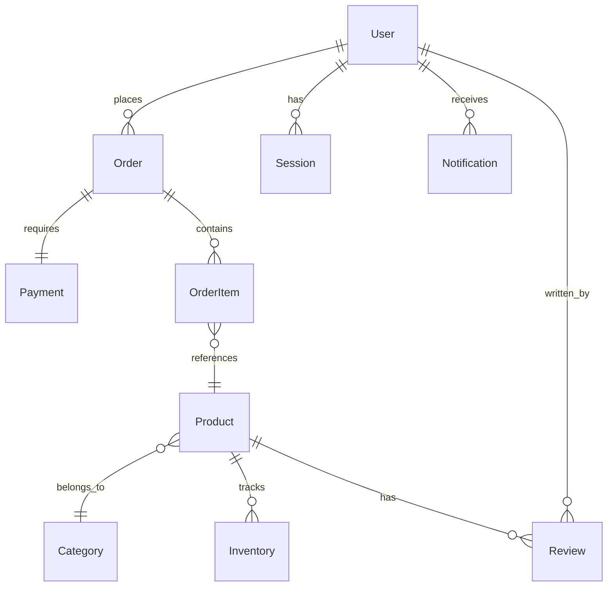

# Data Model Documentation

**Purpose**: Define database schemas, relationships, and data governance policies.  
**Audience**: Backend developers, data engineers, DBAs  
**Update Frequency**: On schema changes, reviewed quarterly

## Database Overview

### Database Systems
| System | Type | Purpose | Version |
|--------|------|---------|---------|
| PostgreSQL | Relational | Primary transactional data | 14.x |
| Redis | Key-Value | Session cache, real-time data | 7.x |
| MongoDB | Document | Unstructured/semi-structured data | 6.x |
| ClickHouse | Columnar | Analytics and time-series | 23.x |

### Database Naming Conventions
- **Databases**: lowercase_with_underscores
- **Tables**: lowercase_with_underscores (plural)
- **Columns**: lowercase_with_underscores
- **Indexes**: idx_table_column
- **Foreign Keys**: fk_source_target
- **Constraints**: chk_table_description

## Core Data Model

### Entity Relationship Diagram


## Schema Definitions

### Users Schema

#### Table: users
```sql
CREATE TABLE users (
    id UUID PRIMARY KEY DEFAULT gen_random_uuid(),
    email VARCHAR(255) UNIQUE NOT NULL,
    username VARCHAR(50) UNIQUE,
    password_hash VARCHAR(255) NOT NULL,
    first_name VARCHAR(100),
    last_name VARCHAR(100),
    phone VARCHAR(20),
    status VARCHAR(20) DEFAULT 'active',
    email_verified BOOLEAN DEFAULT false,
    metadata JSONB DEFAULT '{}',
    created_at TIMESTAMP WITH TIME ZONE DEFAULT CURRENT_TIMESTAMP,
    updated_at TIMESTAMP WITH TIME ZONE DEFAULT CURRENT_TIMESTAMP,
    deleted_at TIMESTAMP WITH TIME ZONE,
    
    CONSTRAINT chk_users_status CHECK (status IN ('active', 'inactive', 'suspended', 'deleted')),
    INDEX idx_users_email (email),
    INDEX idx_users_status (status),
    INDEX idx_users_created_at (created_at DESC)
);
```

#### Table: user_roles
```sql
CREATE TABLE user_roles (
    id UUID PRIMARY KEY DEFAULT gen_random_uuid(),
    user_id UUID NOT NULL REFERENCES users(id) ON DELETE CASCADE,
    role_id UUID NOT NULL REFERENCES roles(id),
    granted_at TIMESTAMP WITH TIME ZONE DEFAULT CURRENT_TIMESTAMP,
    granted_by UUID REFERENCES users(id),
    expires_at TIMESTAMP WITH TIME ZONE,
    
    UNIQUE KEY uk_user_role (user_id, role_id),
    INDEX idx_user_roles_user_id (user_id),
    INDEX idx_user_roles_role_id (role_id)
);
```

### Products Schema

#### Table: products
```sql
CREATE TABLE products (
    id UUID PRIMARY KEY DEFAULT gen_random_uuid(),
    sku VARCHAR(50) UNIQUE NOT NULL,
    name VARCHAR(255) NOT NULL,
    description TEXT,
    category_id UUID REFERENCES categories(id),
    price DECIMAL(10, 2) NOT NULL,
    cost DECIMAL(10, 2),
    status VARCHAR(20) DEFAULT 'active',
    attributes JSONB DEFAULT '{}',
    tags TEXT[],
    created_at TIMESTAMP WITH TIME ZONE DEFAULT CURRENT_TIMESTAMP,
    updated_at TIMESTAMP WITH TIME ZONE DEFAULT CURRENT_TIMESTAMP,
    
    CONSTRAINT chk_products_price CHECK (price >= 0),
    INDEX idx_products_sku (sku),
    INDEX idx_products_category (category_id),
    INDEX idx_products_status (status),
    INDEX idx_products_tags USING GIN (tags),
    FULLTEXT INDEX idx_products_search (name, description)
);
```

### Orders Schema

#### Table: orders
```sql
CREATE TABLE orders (
    id UUID PRIMARY KEY DEFAULT gen_random_uuid(),
    order_number VARCHAR(20) UNIQUE NOT NULL,
    user_id UUID NOT NULL REFERENCES users(id),
    status VARCHAR(20) DEFAULT 'pending',
    subtotal DECIMAL(10, 2) NOT NULL,
    tax DECIMAL(10, 2) DEFAULT 0,
    shipping DECIMAL(10, 2) DEFAULT 0,
    total DECIMAL(10, 2) NOT NULL,
    currency VARCHAR(3) DEFAULT 'USD',
    shipping_address JSONB,
    billing_address JSONB,
    notes TEXT,
    created_at TIMESTAMP WITH TIME ZONE DEFAULT CURRENT_TIMESTAMP,
    updated_at TIMESTAMP WITH TIME ZONE DEFAULT CURRENT_TIMESTAMP,
    completed_at TIMESTAMP WITH TIME ZONE,
    
    CONSTRAINT chk_orders_status CHECK (status IN ('pending', 'processing', 'shipped', 'delivered', 'cancelled', 'refunded')),
    INDEX idx_orders_user_id (user_id),
    INDEX idx_orders_status (status),
    INDEX idx_orders_created_at (created_at DESC)
);
```

### Analytics Schema

#### Table: events
```sql
CREATE TABLE events (
    id UUID DEFAULT gen_random_uuid(),
    event_type VARCHAR(50) NOT NULL,
    user_id UUID,
    session_id UUID,
    properties JSONB DEFAULT '{}',
    context JSONB DEFAULT '{}',
    timestamp TIMESTAMP WITH TIME ZONE DEFAULT CURRENT_TIMESTAMP,
    
    PRIMARY KEY (timestamp, id)
) PARTITION BY RANGE (timestamp);

-- Create monthly partitions
CREATE TABLE events_2024_01 PARTITION OF events
    FOR VALUES FROM ('2024-01-01') TO ('2024-02-01');
```

## Relationships

### One-to-Many Relationships
| Parent | Child | Foreign Key | Cascade | Description |
|--------|-------|------------|---------|-------------|
| users | orders | user_id | RESTRICT | User places orders |
| users | sessions | user_id | CASCADE | User has sessions |
| orders | order_items | order_id | CASCADE | Order contains items |
| categories | products | category_id | SET NULL | Products in categories |

### Many-to-Many Relationships
| Table A | Table B | Junction Table | Description |
|---------|---------|---------------|-------------|
| users | roles | user_roles | User permissions |
| products | tags | product_tags | Product categorization |
| orders | coupons | order_coupons | Applied discounts |

## Indexes

### Performance Indexes
```sql
-- Composite indexes for common queries
CREATE INDEX idx_orders_user_status ON orders(user_id, status);
CREATE INDEX idx_products_category_status ON products(category_id, status);
CREATE INDEX idx_events_user_type ON events(user_id, event_type);

-- Partial indexes for filtered queries
CREATE INDEX idx_users_active ON users(email) WHERE status = 'active';
CREATE INDEX idx_orders_recent ON orders(created_at) WHERE created_at > NOW() - INTERVAL '30 days';

-- Expression indexes
CREATE INDEX idx_users_lower_email ON users(LOWER(email));
```

### Full-Text Search Indexes
```sql
-- PostgreSQL full-text search
CREATE INDEX idx_products_search ON products USING GIN(to_tsvector('english', name || ' ' || description));

-- MongoDB text indexes
db.products.createIndex({ name: "text", description: "text" });
```

## Data Types & Constraints

### Custom Types
```sql
-- Enum types
CREATE TYPE user_status AS ENUM ('active', 'inactive', 'suspended', 'deleted');
CREATE TYPE order_status AS ENUM ('pending', 'processing', 'shipped', 'delivered', 'cancelled', 'refunded');

-- Composite types
CREATE TYPE address AS (
    street1 VARCHAR(255),
    street2 VARCHAR(255),
    city VARCHAR(100),
    state VARCHAR(50),
    postal_code VARCHAR(20),
    country VARCHAR(2)
);
```

### Constraints
```sql
-- Check constraints
ALTER TABLE users ADD CONSTRAINT chk_email_format 
    CHECK (email ~* '^[A-Za-z0-9._%+-]+@[A-Za-z0-9.-]+\.[A-Za-z]{2,}$');

ALTER TABLE products ADD CONSTRAINT chk_price_positive 
    CHECK (price > 0);

-- Unique constraints
ALTER TABLE orders ADD CONSTRAINT uk_order_number 
    UNIQUE (order_number);

-- Foreign key constraints with actions
ALTER TABLE order_items ADD CONSTRAINT fk_order_items_product
    FOREIGN KEY (product_id) REFERENCES products(id)
    ON DELETE RESTRICT ON UPDATE CASCADE;
```

## Data Migrations

### Migration Strategy
```sql
-- Migration file naming: YYYYMMDD_HHMMSS_description.sql
-- Example: 20240101_120000_add_user_preferences.sql

-- Up migration
ALTER TABLE users ADD COLUMN preferences JSONB DEFAULT '{}';
CREATE INDEX idx_users_preferences ON users USING GIN(preferences);

-- Down migration
DROP INDEX IF EXISTS idx_users_preferences;
ALTER TABLE users DROP COLUMN preferences;
```

### Version Control
| Version | Date | Description | Author |
|---------|------|-------------|--------|
| 001 | 2024-01-01 | Initial schema | John Doe |
| 002 | 2024-01-15 | Add user preferences | Jane Smith |
| 003 | 2024-02-01 | Add product variants | Bob Johnson |

## Data Governance

### Data Classification
| Level | Description | Examples | Security Requirements |
|-------|-------------|----------|----------------------|
| Public | Non-sensitive | Product names, categories | None |
| Internal | Business data | Sales figures, analytics | Access control |
| Confidential | User data | Emails, addresses | Encryption, audit |
| Restricted | Sensitive PII | SSN, credit cards | Tokenization, strict access |

### Data Retention
| Data Type | Retention Period | Archive Policy | Deletion Method |
|-----------|-----------------|----------------|-----------------|
| User accounts | 7 years after closure | Cold storage after 1 year | Hard delete |
| Orders | 7 years | Archive after 2 years | Soft delete |
| Sessions | 90 days | No archive | Hard delete |
| Logs | 1 year | Archive after 30 days | Hard delete |
| Analytics | 2 years | Aggregate after 6 months | Hard delete raw |

### PII Handling
```sql
-- Encryption at rest
ALTER TABLE users ALTER COLUMN ssn TYPE bytea 
USING pgp_sym_encrypt(ssn::text, 'encryption_key');

-- Masking for non-production
UPDATE users SET 
    email = CONCAT('user', id, '@example.com'),
    phone = '555-0000',
    ssn = '***-**-****'
WHERE environment != 'production';
```

## Performance Optimization

### Query Optimization
```sql
-- Explain analyze for query planning
EXPLAIN (ANALYZE, BUFFERS) 
SELECT u.*, COUNT(o.id) as order_count
FROM users u
LEFT JOIN orders o ON u.id = o.user_id
WHERE u.status = 'active'
GROUP BY u.id;

-- Query hints
/*+ IndexScan(users idx_users_status) */
SELECT * FROM users WHERE status = 'active';
```

### Partitioning Strategy
```sql
-- Range partitioning for time-series
CREATE TABLE events_2024_q1 PARTITION OF events
    FOR VALUES FROM ('2024-01-01') TO ('2024-04-01');

-- List partitioning for categories
CREATE TABLE products_electronics PARTITION OF products
    FOR VALUES IN ('electronics', 'computers', 'phones');

-- Hash partitioning for distribution
CREATE TABLE users_shard_0 PARTITION OF users
    FOR VALUES WITH (modulus 4, remainder 0);
```

### Caching Strategy
| Data Type | Cache Level | TTL | Invalidation |
|-----------|-------------|-----|--------------|
| User profiles | Redis | 1 hour | On update |
| Product catalog | CDN | 24 hours | Manual purge |
| Session data | Redis | 30 minutes | On logout |
| Analytics | Memory | 5 minutes | Time-based |

## Monitoring & Maintenance

### Key Metrics
```sql
-- Table sizes
SELECT 
    schemaname,
    tablename,
    pg_size_pretty(pg_total_relation_size(schemaname||'.'||tablename)) AS size
FROM pg_tables
ORDER BY pg_total_relation_size(schemaname||'.'||tablename) DESC;

-- Slow queries
SELECT 
    query,
    calls,
    mean_exec_time,
    total_exec_time
FROM pg_stat_statements
WHERE mean_exec_time > 100
ORDER BY mean_exec_time DESC;
```

### Maintenance Tasks
| Task | Frequency | Command | Purpose |
|------|-----------|---------|---------|
| VACUUM | Daily | VACUUM ANALYZE | Reclaim space |
| REINDEX | Weekly | REINDEX TABLE | Rebuild indexes |
| Statistics | Daily | ANALYZE | Update planner stats |
| Backup | Hourly | pg_dump | Data protection |

## Security

### Access Control
```sql
-- Role-based access
CREATE ROLE readonly;
GRANT SELECT ON ALL TABLES IN SCHEMA public TO readonly;

CREATE ROLE api_user;
GRANT SELECT, INSERT, UPDATE ON users, orders TO api_user;

-- Row-level security
ALTER TABLE orders ENABLE ROW LEVEL SECURITY;
CREATE POLICY orders_user_policy ON orders
    FOR ALL
    USING (user_id = current_user_id());
```

### Audit Logging
```sql
CREATE TABLE audit_log (
    id BIGSERIAL PRIMARY KEY,
    table_name VARCHAR(50),
    operation VARCHAR(10),
    user_id UUID,
    changed_data JSONB,
    timestamp TIMESTAMP WITH TIME ZONE DEFAULT CURRENT_TIMESTAMP
);

-- Trigger for audit logging
CREATE TRIGGER audit_trigger
AFTER INSERT OR UPDATE OR DELETE ON users
FOR EACH ROW EXECUTE FUNCTION audit_changes();
```

## Disaster Recovery

### Backup Strategy
- **Full Backup**: Daily at 02:00 UTC
- **Incremental**: Every 6 hours
- **Transaction Logs**: Continuous archival
- **Retention**: 30 days local, 90 days cloud

### Recovery Procedures
1. **Point-in-Time Recovery**: Restore to any second within retention
2. **Failover**: Automatic to replica within 30 seconds
3. **Data Validation**: Checksums on all backups
4. **Test Restores**: Weekly validation

---
*Last Updated: [Date]*  
*Next Review: [Date]*  
*Database Owner: [Name]*