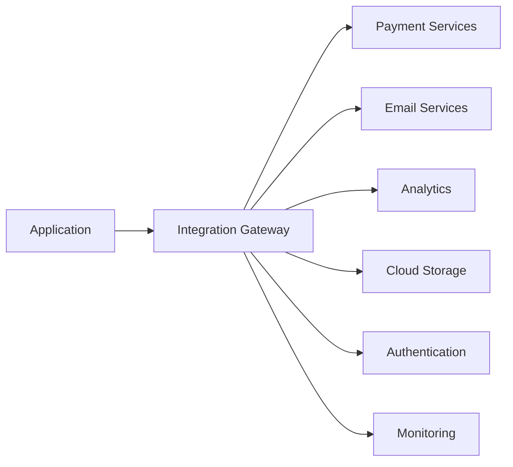

# Third-Party Integrations

**Purpose**: Document external services, APIs, and integration patterns used in the system.  
**Audience**: Backend developers, DevOps engineers, integration partners  
**Update Frequency**: When adding/modifying integrations, quarterly review

## Integration Overview

### Integration Architecture


### Integration Principles
1. **Abstraction**: Wrap third-party APIs in internal interfaces
2. **Resilience**: Implement circuit breakers and fallbacks
3. **Monitoring**: Track all external calls
4. **Security**: Never expose API keys in code
5. **Testing**: Mock external services in tests

## Payment Processing

### Stripe Integration
**Purpose**: Payment processing, subscriptions, invoicing  
**Documentation**: https://stripe.com/docs  
**Environment Variables**:
```bash
STRIPE_SECRET_KEY=sk_live_...
STRIPE_PUBLISHABLE_KEY=pk_live_...
STRIPE_WEBHOOK_SECRET=whsec_...
```

#### Key Operations
```javascript
// Initialize
const stripe = require('stripe')(process.env.STRIPE_SECRET_KEY);

// Create payment intent
const paymentIntent = await stripe.paymentIntents.create({
  amount: 2000, // $20.00
  currency: 'usd',
  payment_method_types: ['card'],
  metadata: { order_id: 'ord_123' }
});

// Create subscription
const subscription = await stripe.subscriptions.create({
  customer: 'cus_123',
  items: [{ price: 'price_123' }],
  trial_period_days: 14
});
```

#### Webhook Events
| Event | Handler | Description |
|-------|---------|-------------|
| payment_intent.succeeded | handlePaymentSuccess | Payment completed |
| payment_intent.failed | handlePaymentFailure | Payment failed |
| customer.subscription.created | handleNewSubscription | Subscription started |
| customer.subscription.deleted | handleCancellation | Subscription cancelled |
| invoice.payment_failed | handleFailedInvoice | Recurring payment failed |

#### Error Handling
```javascript
try {
  await stripe.charges.create({...});
} catch (error) {
  switch (error.type) {
    case 'StripeCardError':
      // Card declined
      break;
    case 'StripeRateLimitError':
      // Too many requests
      break;
    case 'StripeInvalidRequestError':
      // Invalid parameters
      break;
  }
}
```

## Email Services

### SendGrid Integration
**Purpose**: Transactional emails, marketing campaigns  
**Documentation**: https://sendgrid.com/docs  
**Environment Variables**:
```bash
SENDGRID_API_KEY=SG...
SENDGRID_FROM_EMAIL=noreply@example.com
SENDGRID_TEMPLATE_PREFIX=d-
```

#### Email Templates
| Template ID | Name | Trigger | Variables |
|-------------|------|---------|-----------|
| d-welcome | Welcome Email | User signup | name, verify_url |
| d-reset | Password Reset | Reset request | name, reset_url |
| d-order | Order Confirmation | Order placed | order_number, items, total |
| d-newsletter | Newsletter | Weekly schedule | articles, unsubscribe_url |

#### Implementation
```javascript
const sgMail = require('@sendgrid/mail');
sgMail.setApiKey(process.env.SENDGRID_API_KEY);

// Send templated email
await sgMail.send({
  to: user.email,
  from: process.env.SENDGRID_FROM_EMAIL,
  templateId: 'd-welcome',
  dynamicTemplateData: {
    name: user.name,
    verify_url: `${BASE_URL}/verify/${token}`
  }
});
```

#### Delivery Tracking
```javascript
// Webhook handler for SendGrid events
app.post('/webhooks/sendgrid', (req, res) => {
  req.body.forEach(event => {
    switch(event.event) {
      case 'delivered':
        logDelivery(event.email, event.timestamp);
        break;
      case 'bounce':
        handleBounce(event.email, event.reason);
        break;
      case 'spam_report':
        handleSpamReport(event.email);
        break;
    }
  });
});
```

## Authentication Services

### Auth0 Integration
**Purpose**: User authentication, SSO, MFA  
**Documentation**: https://auth0.com/docs  
**Environment Variables**:
```bash
AUTH0_DOMAIN=your-tenant.auth0.com
AUTH0_CLIENT_ID=...
AUTH0_CLIENT_SECRET=...
AUTH0_AUDIENCE=https://api.example.com
```

#### Configuration
```javascript
const { auth } = require('express-openid-connect');

app.use(auth({
  authRequired: false,
  auth0Logout: true,
  baseURL: process.env.BASE_URL,
  clientID: process.env.AUTH0_CLIENT_ID,
  issuerBaseURL: `https://${process.env.AUTH0_DOMAIN}`,
  secret: process.env.AUTH0_CLIENT_SECRET
}));
```

#### User Management
```javascript
// Get user profile
const user = await managementClient.getUser({ id: userId });

// Update user metadata
await managementClient.updateUserMetadata(
  { id: userId },
  { plan: 'premium', credits: 100 }
);

// Assign roles
await managementClient.assignRolestoUser(
  { id: userId },
  { roles: ['rol_admin'] }
);
```

## Analytics & Tracking

### Google Analytics 4
**Purpose**: User behavior tracking, conversion tracking  
**Documentation**: https://developers.google.com/analytics  
**Configuration**:
```javascript
// Client-side
gtag('config', 'G-MEASUREMENT_ID', {
  user_id: userId,
  custom_map: {
    dimension1: 'user_type',
    dimension2: 'subscription_plan'
  }
});

// Server-side
const measurement = google.analytics('v4');
await measurement.events.create({
  client_id: clientId,
  events: [{
    name: 'purchase',
    params: {
      value: 29.99,
      currency: 'USD',
      transaction_id: 'ord_123'
    }
  }]
});
```

### Segment Integration
**Purpose**: Customer data platform, event routing  
**Documentation**: https://segment.com/docs  
**Implementation**:
```javascript
const Analytics = require('analytics-node');
const analytics = new Analytics(process.env.SEGMENT_WRITE_KEY);

// Track event
analytics.track({
  userId: user.id,
  event: 'Order Completed',
  properties: {
    order_id: order.id,
    total: order.total,
    products: order.items
  }
});

// Identify user
analytics.identify({
  userId: user.id,
  traits: {
    email: user.email,
    name: user.name,
    plan: user.subscription_plan
  }
});
```

## Cloud Storage

### AWS S3 Integration
**Purpose**: File storage, media hosting, backups  
**Documentation**: https://docs.aws.amazon.com/s3  
**Environment Variables**:
```bash
AWS_ACCESS_KEY_ID=...
AWS_SECRET_ACCESS_KEY=...
AWS_REGION=us-east-1
S3_BUCKET_NAME=my-app-uploads
```

#### Operations
```javascript
const AWS = require('aws-sdk');
const s3 = new AWS.S3();

// Upload file
const upload = await s3.upload({
  Bucket: process.env.S3_BUCKET_NAME,
  Key: `uploads/${userId}/${filename}`,
  Body: fileBuffer,
  ContentType: mimeType,
  ACL: 'private'
}).promise();

// Generate presigned URL
const url = s3.getSignedUrl('getObject', {
  Bucket: process.env.S3_BUCKET_NAME,
  Key: fileKey,
  Expires: 3600 // 1 hour
});

// Delete file
await s3.deleteObject({
  Bucket: process.env.S3_BUCKET_NAME,
  Key: fileKey
}).promise();
```

#### CDN Configuration
```javascript
// CloudFront distribution
const cloudfront = new AWS.CloudFront();
await cloudfront.createInvalidation({
  DistributionId: process.env.CLOUDFRONT_DISTRIBUTION_ID,
  InvalidationBatch: {
    CallerReference: Date.now().toString(),
    Paths: {
      Quantity: 1,
      Items: ['/images/*']
    }
  }
}).promise();
```

## Messaging & Notifications

### Twilio Integration
**Purpose**: SMS, voice calls, WhatsApp  
**Documentation**: https://www.twilio.com/docs  
**Environment Variables**:
```bash
TWILIO_ACCOUNT_SID=...
TWILIO_AUTH_TOKEN=...
TWILIO_PHONE_NUMBER=+1234567890
```

#### SMS Implementation
```javascript
const twilio = require('twilio');
const client = twilio(
  process.env.TWILIO_ACCOUNT_SID,
  process.env.TWILIO_AUTH_TOKEN
);

// Send SMS
await client.messages.create({
  body: 'Your verification code is: 123456',
  from: process.env.TWILIO_PHONE_NUMBER,
  to: userPhoneNumber
});

// Send WhatsApp
await client.messages.create({
  body: 'Your order has been shipped!',
  from: 'whatsapp:+14155238886',
  to: `whatsapp:${userPhoneNumber}`
});
```

### Push Notifications (Firebase)
**Purpose**: Mobile push notifications  
**Documentation**: https://firebase.google.com/docs/cloud-messaging  
**Implementation**:
```javascript
const admin = require('firebase-admin');
admin.initializeApp({
  credential: admin.credential.cert(serviceAccount)
});

// Send to device
await admin.messaging().send({
  token: deviceToken,
  notification: {
    title: 'New Message',
    body: 'You have a new message from John'
  },
  data: {
    messageId: 'msg_123',
    type: 'chat'
  }
});

// Send to topic
await admin.messaging().send({
  topic: 'promotions',
  notification: {
    title: 'Special Offer!',
    body: '50% off everything today only'
  }
});
```

## Search Services

### Algolia Integration
**Purpose**: Full-text search, faceted search  
**Documentation**: https://www.algolia.com/doc  
**Environment Variables**:
```bash
ALGOLIA_APP_ID=...
ALGOLIA_ADMIN_KEY=...
ALGOLIA_SEARCH_KEY=...
```

#### Index Management
```javascript
const algoliasearch = require('algoliasearch');
const client = algoliasearch(
  process.env.ALGOLIA_APP_ID,
  process.env.ALGOLIA_ADMIN_KEY
);
const index = client.initIndex('products');

// Add/update records
await index.saveObjects([
  {
    objectID: 'prod_123',
    name: 'Product Name',
    description: 'Product description',
    price: 29.99,
    categories: ['electronics', 'gadgets']
  }
]);

// Configure index
await index.setSettings({
  searchableAttributes: ['name', 'description'],
  attributesForFaceting: ['categories', 'price'],
  ranking: ['typo', 'geo', 'words', 'filters', 'proximity', 'attribute', 'exact', 'custom']
});

// Search
const results = await index.search('query', {
  facetFilters: ['categories:electronics'],
  page: 0,
  hitsPerPage: 20
});
```

## Monitoring & Logging

### Datadog Integration
**Purpose**: APM, infrastructure monitoring, logs  
**Documentation**: https://docs.datadoghq.com  
**Environment Variables**:
```bash
DD_API_KEY=...
DD_APP_KEY=...
DD_SERVICE=my-app
DD_ENV=production
```

#### APM Setup
```javascript
const tracer = require('dd-trace').init({
  service: process.env.DD_SERVICE,
  env: process.env.DD_ENV,
  analytics: true,
  logInjection: true
});

// Custom metrics
const StatsD = require('node-dogstatsd').StatsD;
const dogstatsd = new StatsD();

dogstatsd.increment('api.requests');
dogstatsd.histogram('api.response_time', responseTime);
dogstatsd.gauge('queue.size', queueSize);
```

### Sentry Integration
**Purpose**: Error tracking, performance monitoring  
**Documentation**: https://docs.sentry.io  
**Implementation**:
```javascript
const Sentry = require('@sentry/node');

Sentry.init({
  dsn: process.env.SENTRY_DSN,
  environment: process.env.NODE_ENV,
  tracesSampleRate: 0.1,
  beforeSend(event) {
    // Scrub sensitive data
    if (event.request?.cookies) {
      delete event.request.cookies;
    }
    return event;
  }
});

// Capture custom error
Sentry.captureException(error, {
  tags: { module: 'payment' },
  extra: { orderId: order.id }
});
```

## API Rate Limiting

### Redis-based Rate Limiting
```javascript
const rateLimit = require('express-rate-limit');
const RedisStore = require('rate-limit-redis');

const limiter = rateLimit({
  store: new RedisStore({
    client: redisClient,
    prefix: 'rl:'
  }),
  windowMs: 15 * 60 * 1000, // 15 minutes
  max: 100, // limit each IP to 100 requests per windowMs
  message: 'Too many requests from this IP'
});

app.use('/api/', limiter);
```

## Circuit Breaker Pattern

### Implementation for External Services
```javascript
const CircuitBreaker = require('opossum');

const options = {
  timeout: 3000,
  errorThresholdPercentage: 50,
  resetTimeout: 30000
};

const breaker = new CircuitBreaker(callExternalAPI, options);

breaker.on('open', () => console.log('Circuit breaker opened'));
breaker.on('halfOpen', () => console.log('Circuit breaker half-open'));
breaker.on('close', () => console.log('Circuit breaker closed'));

// Use with fallback
const result = await breaker.fire(params)
  .catch(() => getFallbackData());
```

## Integration Testing

### Mock Services
```javascript
// Mock Stripe for testing
const stripeMock = {
  paymentIntents: {
    create: jest.fn().mockResolvedValue({
      id: 'pi_test_123',
      status: 'succeeded'
    })
  }
};

// Mock SendGrid for testing
const sgMailMock = {
  send: jest.fn().mockResolvedValue([{
    statusCode: 202,
    headers: {},
    body: ''
  }])
};
```

### Contract Testing
```javascript
// Pact consumer test
describe('API Consumer', () => {
  it('should receive user data', async () => {
    await provider.addInteraction({
      state: 'user exists',
      uponReceiving: 'a request for user',
      withRequest: {
        method: 'GET',
        path: '/users/123'
      },
      willRespondWith: {
        status: 200,
        body: {
          id: '123',
          name: 'John Doe'
        }
      }
    });
  });
});
```

## Webhook Management

### Webhook Registry
| Service | Endpoint | Events | Secret | Retry Policy |
|---------|----------|---------|--------|--------------|
| Stripe | /webhooks/stripe | payment.* | ENV VAR | 3x exponential |
| SendGrid | /webhooks/sendgrid | email.* | ENV VAR | 5x linear |
| GitHub | /webhooks/github | push, pr | ENV VAR | 3x exponential |

### Webhook Security
```javascript
// Verify webhook signature
function verifyWebhookSignature(payload, signature, secret) {
  const computedSignature = crypto
    .createHmac('sha256', secret)
    .update(payload)
    .digest('hex');
  
  return crypto.timingSafeEqual(
    Buffer.from(signature),
    Buffer.from(computedSignature)
  );
}
```

## Cost Management

### Service Usage Limits
| Service | Tier | Monthly Limit | Current Usage | Alert at |
|---------|------|---------------|---------------|----------|
| Stripe | Standard | Unlimited | $50K/mo | - |
| SendGrid | Pro | 100K emails | 45K | 90K |
| Auth0 | Developer Pro | 7K MAU | 3.5K | 6K |
| Algolia | Standard | 1M searches | 450K | 900K |
| Datadog | Pro | 100 hosts | 45 | 90 |

---
*Last Updated: [Date]*  
*Next Review: [Date]*  
*Integration Owner: [Name]*