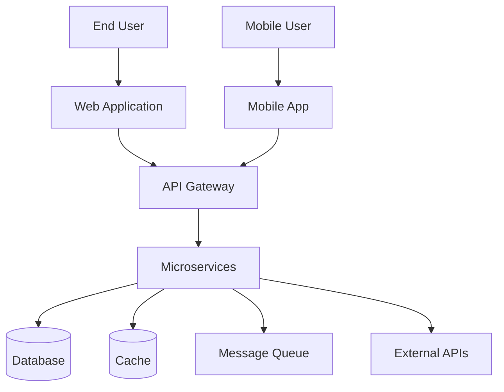

# System Design

**Purpose**: Document high-level system architecture, components, and their interactions.  
**Audience**: Engineers, architects, technical stakeholders  
**Update Frequency**: On major architectural changes or quarterly review

## System Overview

### Executive Summary
[2-3 paragraphs describing the system, its purpose, and key architectural decisions]

### System Context Diagram


## Architecture Principles

1. **Scalability**: [How the system scales]
2. **Reliability**: [How we ensure uptime]
3. **Security**: [Security-first approach]
4. **Performance**: [Performance targets]
5. **Maintainability**: [Code organization]
6. **Observability**: [Monitoring strategy]

## High-Level Architecture

### Architectural Pattern
**Pattern**: [Microservices | Monolithic | Serverless | Hybrid]  
**Justification**: [Why this pattern was chosen]

### Component Architecture
```
┌─────────────────────────────────────────────────────┐
│                   Presentation Layer                 │
├─────────────────────────────────────────────────────┤
│                   Application Layer                  │
├─────────────────────────────────────────────────────┤
│                    Business Layer                    │
├─────────────────────────────────────────────────────┤
│                      Data Layer                      │
└─────────────────────────────────────────────────────┘
```

## Core Components

### Component 1: [Name]
**Purpose**: [What it does]  
**Technology**: [Tech stack used]  
**Responsibilities**:
- [Responsibility 1]
- [Responsibility 2]

**Interfaces**:
- Input: [What it receives]
- Output: [What it produces]
- Dependencies: [What it depends on]

**Scaling Strategy**: [How it scales]  
**Failure Handling**: [How it handles failures]

### Component 2: [Name]
[Repeat structure above]

## Data Architecture

### Data Flow
```
[Source] → [Process] → [Transform] → [Store] → [Serve]
```

### Storage Systems

#### Primary Database
- **Type**: [Relational/NoSQL/Graph]
- **Technology**: [PostgreSQL/MongoDB/etc]
- **Purpose**: [What data it stores]
- **Backup Strategy**: [How/when backed up]
- **Replication**: [Master-slave/Multi-master]

#### Cache Layer
- **Technology**: [Redis/Memcached]
- **Strategy**: [Cache-aside/Write-through]
- **TTL Policy**: [Expiration rules]
- **Invalidation**: [How cache is invalidated]

#### Data Warehouse
- **Technology**: [BigQuery/Snowflake/etc]
- **Update Frequency**: [Real-time/Batch]
- **Purpose**: [Analytics/Reporting]

### Data Models

#### Entity Relationship
```
User ──1:N──> Order ──N:N──> Product
  │             │
  └──1:N──> Payment
```

#### Key Entities
| Entity | Storage | Volume | Growth Rate |
|--------|---------|---------|-------------|
| Users | PostgreSQL | 1M | 10K/month |
| Orders | PostgreSQL | 10M | 100K/month |
| Events | ClickHouse | 1B | 10M/day |

## API Architecture

### API Gateway
**Technology**: [Kong/AWS API Gateway/etc]  
**Responsibilities**:
- Authentication/Authorization
- Rate limiting
- Request routing
- Response caching

### Service Communication
**Protocol**: [REST/GraphQL/gRPC]  
**Format**: [JSON/Protocol Buffers]  
**Pattern**: [Sync/Async/Event-driven]

### API Versioning Strategy
- **Method**: [URL/Header/Query param]
- **Deprecation Policy**: [Timeline]
- **Backward Compatibility**: [Approach]

## Security Architecture

### Authentication & Authorization
**Authentication Method**: [OAuth2/JWT/SAML]  
**Authorization Model**: [RBAC/ABAC]  
**Token Management**: [Storage and refresh strategy]

### Security Layers
1. **Network Security**: [Firewalls, VPN, etc]
2. **Application Security**: [Input validation, OWASP]
3. **Data Security**: [Encryption at rest/transit]
4. **Infrastructure Security**: [Cloud security, IAM]

### Threat Model
| Threat | Likelihood | Impact | Mitigation |
|--------|------------|---------|------------|
| SQL Injection | Low | High | Parameterized queries |
| DDoS | Medium | High | Rate limiting, CDN |
| Data Breach | Low | Critical | Encryption, access controls |

## Infrastructure

### Deployment Architecture
**Platform**: [AWS/GCP/Azure/On-premise]  
**Orchestration**: [Kubernetes/Docker Swarm/ECS]  
**CI/CD**: [Jenkins/GitLab CI/GitHub Actions]

### Environment Strategy
| Environment | Purpose | Infrastructure | Data |
|-------------|---------|---------------|------|
| Development | Feature development | Minimal | Synthetic |
| Staging | Pre-production testing | Production-like | Anonymized |
| Production | Live system | Full scale | Real |

### Disaster Recovery
**RPO (Recovery Point Objective)**: [Time]  
**RTO (Recovery Time Objective)**: [Time]  
**Backup Strategy**: [Approach]  
**Failover Process**: [Steps]

## Performance Considerations

### Performance Requirements
| Metric | Requirement | Current | Target |
|--------|------------|---------|---------|
| Response Time (P50) | <200ms | [X]ms | [Y]ms |
| Response Time (P99) | <1s | [X]ms | [Y]ms |
| Throughput | 10K RPS | [X] RPS | [Y] RPS |
| Concurrent Users | 100K | [X] | [Y] |

### Optimization Strategies
1. **Caching**: [Where and what]
2. **Database Optimization**: [Indexes, queries]
3. **CDN**: [Static content delivery]
4. **Load Balancing**: [Algorithm and setup]
5. **Async Processing**: [Queue-based tasks]

## Scalability Design

### Horizontal Scaling
- **Services**: [Auto-scaling policies]
- **Database**: [Sharding strategy]
- **Cache**: [Distributed caching]

### Vertical Scaling
- **When Applied**: [Scenarios]
- **Limits**: [Maximum capacity]

### Bottlenecks & Solutions
| Bottleneck | Current Limit | Solution | Timeline |
|------------|---------------|----------|-----------|
| Database connections | 100 | Connection pooling | Q1 |
| API Gateway | 5K RPS | Add instances | Q2 |

## Monitoring & Observability

### Metrics Collection
- **Application Metrics**: [APM tool]
- **Infrastructure Metrics**: [Monitoring tool]
- **Business Metrics**: [Analytics platform]

### Logging Strategy
- **Log Aggregation**: [ELK/Splunk/etc]
- **Log Levels**: ERROR, WARN, INFO, DEBUG
- **Retention Policy**: [Duration by level]

### Alerting Rules
| Alert | Condition | Severity | Action |
|-------|-----------|----------|---------|
| High Error Rate | >5% errors | Critical | Page on-call |
| High Latency | P99 >2s | Warning | Slack alert |
| Low Disk Space | <10% free | Warning | Auto-scale |

## Technology Stack

### Core Technologies
| Layer | Technology | Version | Purpose |
|-------|------------|---------|---------|
| Frontend | React | 18.x | UI framework |
| Backend | Node.js | 18.x | API server |
| Database | PostgreSQL | 14.x | Primary data store |
| Cache | Redis | 7.x | Session & data cache |
| Queue | RabbitMQ | 3.x | Async processing |

### Supporting Technologies
| Category | Technology | Purpose |
|----------|------------|---------|
| Monitoring | Datadog | APM & Infrastructure |
| CI/CD | GitHub Actions | Automation |
| Container | Docker | Containerization |
| Orchestration | Kubernetes | Container management |

## Trade-offs & Decisions

### Architectural Trade-offs
| Decision | Trade-off | Rationale |
|----------|-----------|-----------|
| Microservices | Complexity vs Scalability | Need independent scaling |
| NoSQL for events | Consistency vs Performance | Performance critical |
| Sync API calls | Latency vs Simplicity | Simplicity wins for MVP |

### Technical Debt
| Item | Impact | Priority | Resolution Plan |
|------|---------|----------|-----------------|
| Legacy service | Performance | High | Rewrite in Q2 |
| Missing tests | Quality | Medium | Add in sprints |

## Migration & Evolution

### Current State → Future State
```
Current: Monolith → Transitional: Hybrid → Target: Microservices
         (Now)           (6 months)           (12 months)
```

### Migration Strategy
1. **Phase 1**: [What to migrate first]
2. **Phase 2**: [Next components]
3. **Phase 3**: [Final state]

## Appendix

### Glossary
- **Term**: Definition
- **Acronym**: Expansion

### References
- [Architecture Decision Records]
- [API Documentation]
- [Infrastructure as Code]

### Diagrams
- [Detailed component diagrams]
- [Sequence diagrams]
- [Network topology]

---
*Last Updated: [Date]*  
*Next Review: [Date]*  
*Architect: [Name]*